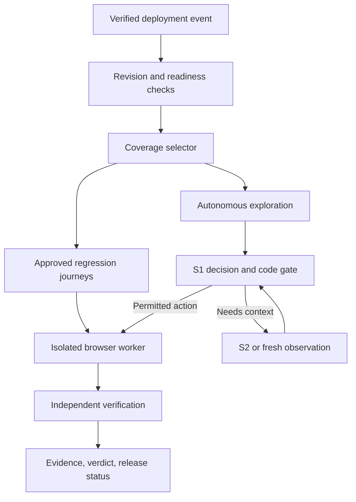

# System One–Driven Autonomous UI/UX Testing

## Research-backed implementation plan in phases — no timelines

Research checked: September 27, 2026. Intended audience: engineering lead and coding agent implementing a new testing platform. Status: architecture and implementation specification; no application integration or live model benchmark has been executed for this document.

## 1. Direct answers and scope

**Build around System One models, with Jev as the first provider.** The browser-use repository is an architectural reference, not the foundation we must fork. We own the browser runtime, test contracts, action permissions, verification, deployment integration, and evidence. System One supplies narrow structured judgments. System Two supplies planning, difficult disambiguation, and optional visual interpretation.

**Yes, automatically trigger testing on new deployments.** A deployment-ready event starts a run against that deployment's immutable URL and verified revision. Select tests affected by changes, always include critical smoke journeys, execute an independent verdict, and publish the result against the exact deployed commit. A release gate can then hold promotion. Testing an already-live production deployment is monitoring; it cannot retroactively prevent exposure.

The intended product is a web testing service that combines repeatable regression tests with bounded autonomous exploration. Initial scope: owned web applications in preview/staging, Chromium, ordinary HTML/ARIA controls, desktop and mobile viewport profiles, seeded test accounts, functional assertions, visual checkpoints, and automated accessibility checks. Native mobile applications, arbitrary canvas interaction, and claims of complete human usability assessment are outside the first release.

Assumptions: the team can provision an isolated test tenant, identify deployed versions, and specify expected behavior. If repository access, business rules, or backend observation are unavailable, the report explicitly identifies the resulting coverage limits. No “all tests passed” claim may imply untested requirements passed.

## 2. What research establishes

| Verified fact | Design implication | Source |
| --- | --- | --- |
| TypeSafe exposes Choice, Score, and Noul; questions in a request see the same state and do not consume one another's answers. | Put the operation assumption inside each speculative target question. Compose results in code. | [S1], [S2] |
| Choice/Score confidence summarizes the returned distribution; Noul has no separate confidence field. | Track raw probabilities and confidence separately. Establish correctness empirically. | [S3] |
| Jev's documented model is text-only; versioned model IDs are supported. | Send structured browser state to Jev; route screenshots to a vision-capable S2. Pin the model used for release decisions. | [S4] |
| The API permits up to 255 Choice options. | Bound candidate sets and reserve a NONE option; use explicit hierarchy if necessary. | [S5] |
| TypeSafe documents weaknesses involving numbers, dates, indirection, irrelevant context, and adversarial content. | Keep exact comparisons and policy enforcement in code; test context and extraction quality. | [S6] |
| GitHub supports deployment-status events; inactive status does not trigger that workflow. | Normalize provider events and filter for readiness rather than assuming every deployment notification means ready. | [S7] |
| Vercel supports deployment-ready integration and checks before production domain assignment. | Provider integration can gate promotion, with correct event and commit-status wiring. | [S8], [S9] |
| Playwright provides actionability checks, assertions, traces, visual comparisons, and accessibility integration. | Reuse these execution and inspection primitives. | [S10]–[S14] |
| Playwright also offers planner, generator, and healer agents. | Benchmark against existing tooling; our added value must be measured reliability, cost, and deployment coverage. | [S15] |

These facts establish available capabilities, not performance on our application. All thresholds, architecture choices, budgets, and release criteria below are proposed engineering policies unless explicitly identified as provider behavior.

## 3. Revalidation of Claude's proposal

The overall S1 → gate → act/re-observe/S2 pattern is useful. Adopt it with the following corrections.

| Proposal | Assessment | Implementation decision |
| --- | --- | --- |
| One call with operation and target heads | Sound batching pattern | Each target question explicitly says “assuming CLICK/TYPE/SELECT is selected.” Validate and use only the matching target. |
| Other heads are free speculation | Extra round trips are avoided, but input tokens and context limits still matter | Measure request size, billed usage, and latency. Batch only relevant heads. |
| `p(op) × p(target)` is joint probability | Not established by multiplying two returned scores | Log it as `pair_score`, an uncalibrated feature. Calibrate correctness of the complete executable action. |
| Target margin catches flips | Useful diagnostic, not sufficient | Include operation margin, candidate count, missing-context signals, and argument validity. |
| Joint ≥ 0.8 plus margin ≥ 0.2 | The margin condition is redundant for normalized scores in that Act band | If a product is ≥ 0.8, each factor is ≥ 0.8; top-two margin for either distribution is then at least 0.6. Treat bands as experimental configurations, not independent protections. |
| Re-ask only the top three | Can exclude the correct target and inflate remaining scores | Improve context, preserve original scores, add NONE/NEED_MORE_CONTEXT, and measure shortlist recall. Never compare renormalized scores as if the question were unchanged. |
| High risk below 0.95 → S2 | Probability does not grant permission | Enforce a deterministic environment/action policy first. S2 cannot authorize a forbidden operation. |
| Re-observe by waiting or scrolling | Waiting may help; scrolling changes state | Re-observation can be read-only. Scroll is a separately validated action. Every retry must acquire evidence or stop. |
| Page fingerprint changed → progress | Change is neither necessary nor sufficient | Evaluate action-specific postconditions and task milestones. Ignore clocks and spinners for progress. |
| No change three times → blocked | Useful heuristic with exceptions | Account for asynchronous completion and negative tests that expect no mutation; combine loop, deadline, and postcondition budgets. |
| 200–500 labeled steps calibrate 99% precision | Useful pilot size, not a universal assurance | Separate fitting, threshold selection, and held-out evaluation; report uncertainty by cohort and full journey. |
| Tie routing makes execution deterministic | It can reduce one form of instability | Pin versions and data, retain outcomes, and report flakiness. Models and browser systems can still vary. |
| Many escalations prove ambiguous UX | Only a hypothesis | Check candidate extraction, model errors, loading, and context before proposing a UX finding. |

### 3.1 Correct probability interpretation

The chain rule is `P(op,target | state) = P(op | state) × P(target | op,state)`. A target question conditioned in its instructions on an operation resembles that factorization, but returned scores do not by themselves establish calibrated conditional probabilities or the correctness of the resulting action. Parallel evaluation also does not establish statistical independence between errors.

Model certainty, correct target selection, valid field value, permitted side effect, and application success are different events. A perfectly confident click can still be stale, forbidden, semantically wrong, or followed by an application defect.

Use a gate feature vector containing operation/target probabilities, their margins, provider confidence, candidate count, argument validation, candidate coverage, freshness, risk class, and recent outcomes. Fit a simple interpretable calibrator only after collecting enough representative labeled examples. Keep the raw features and calibration version.

### 3.2 Correct checkout example

Given click probability 0.93 and target probabilities 0.48 versus 0.44, the margin is 0.04 and pair score is 0.4464. Obtain more context instead of acting. If the target later scores 0.88 while the operation remains 0.93, the pair score is 0.8184. It does not meet a pair threshold of 0.95. Raising only the target threshold cannot solve an operation score below the required pair threshold.

In staging, a test-owned checkout action can be preauthorized in the scenario. S2 can disambiguate using the cart/order section, a screenshot, and the expected milestone. Before clicking, the runtime rechecks the observed target, test tenant, cart fixture, sandbox payment configuration, and single-submission ledger. After clicking, independently verify exactly one persisted order and the expected integer-minor-unit total.

Report “the model could not distinguish these actions with the available observation” if that is all the evidence shows. Claim equal visual emphasis only if screenshot/style evidence supports it. Claim human confusion only with appropriate human evidence.

## 4. Product architecture

Use three coordinated layers:

1. **Deterministic controller:** deployment identity, fixtures, allowed actions, browser operations, exact assertions, budgets, verdicts, and reporting.
2. **System One:** immediate operation/target choices, bounded semantic classification, and selection among known exploration alternatives.
3. **System Two:** initial scenario proposals, missing-context diagnosis, difficult disambiguation, visual interpretation, and repair proposals.

The controller is the authority. S1/S2 have no credentials, shell access, or independent browser channel. They return typed proposals; the controller decides whether execution is permitted.



### 4.1 Recommended implementation stack

Use TypeScript for the controller, browser workers, schemas, and initial API. This revises the earlier Python-first suggestion: the reference repository no longer constrains the language, and direct integration with Playwright Test, axe-core, and typed scenario contracts avoids a second runtime at the outset.

| Area | Initial choice and boundary |
| --- | --- |
| Browser/test runtime | Playwright Test; one worker owns all actions for its page/context |
| S1 integration | `SystemOneProvider` adapter over TypeSafe HTTP API; evaluate SDK adoption separately |
| S2 integration | Provider-neutral structured-output adapter; require image support for visual escalation |
| Validation | Zod schemas with versioned JSON Schema exports |
| Control API | Fastify service; a CLI invokes the same application services |
| Durable state | PostgreSQL, transactional outbox, leased jobs; avoid adding a separate queue until required |
| Artifacts | S3-compatible object storage with tenant-scoped keys and checksums |
| UI | Small React dashboard after runner correctness is established |
| Runtime | Pinned container image with matching browser binaries and fonts |
| Integrations | GitHub deployment adapter first; provider-specific adapters behind one interface |

No model provider name appears in scenario contracts. Alternative S1 implementations must satisfy the adapter interface and pass the same evaluation suite; “System One” is an architectural role, not a guarantee of interchangeable provider behavior.

### 4.2 Repository structure to implement

| Path | Responsibility |
| --- | --- |
| `apps/api/` | Project configuration, authenticated event ingestion, run APIs |
| `apps/worker/` | Leases, browser lifecycle, attempt execution, cleanup |
| `apps/cli/` | Local runs, readiness checks, result waiting, calibration commands |
| `apps/dashboard/` | Run history, evidence, baselines, reviewed findings |
| `packages/contracts/` | Schemas, state transitions, verdict policy |
| `packages/browser/` | Observations, node registry, supported actions, instrumentation |
| `packages/s1/` | Provider adapter, question builders, response validation |
| `packages/gate/` | Permission checks, uncertainty routing, calibration |
| `packages/s2/` | Planner and escalation adapters; typed proposals only |
| `packages/oracles/` | UI, API, persistence, negative, and metamorphic assertions |
| `packages/quality/` | Visual, accessibility, layout, UX hypotheses |
| `packages/coverage/` | Requirement graph, change impact, selection explanations |
| `packages/integrations/` | Deployment providers and commit-status publishing |
| `packages/evidence/` | Event log, redaction, artifacts, HTML/JUnit reports |
| `fixtures/test-app/` | Controlled app with switchable known defects |
| `evals/` | Labeled observations, held-out journeys, drift and ablation tools |
| `specs/` | Versioned approved scenarios and project policies |

## 5. Core contracts

Implement contracts before integrating a model. The examples below define our proposed application schema, not existing Jev fields or ready-to-run commands.

### 5.1 Deployment envelope

Required fields: schema version, tenant/project/repository ID, provider, delivery ID, deployment ID, environment, immutable URL, commit SHA, artifact digest where available, observed event time, readiness type, and verified event provenance. Add backend revision, feature-flag/config digest, and schema version when available.

Deduplication key: `(tenant, project, provider, deployment_id, suite_revision, execution_profile)`. A deliberate rerun creates a new attempt ID. Redelivery of the same event does not create another logical run. Different feature-flag configurations or browser profiles are distinct executions.

Persist a verified version manifest separately from the untrusted incoming payload. Never accept a URL solely because it appeared in a webhook.

### 5.2 Scenario contract

```yaml
schema_version: 1
id: checkout_existing_customer
requirement_ids: [CHECKOUT-01, CHECKOUT-02]
mode: regression
start_path: /cart
fixture: customer_cart_one_item_v1
role: customer
goal: Place the fixture order using the supplied delivery address.
milestones:
  - id: order_persisted
    action_intent: checkout.submit
    assertions:
      - type: ui_visible
        target: order-confirmation
      - type: order_count_delta
        customer_ref: fixture.customer_id
        equals: 1
      - type: order_total_minor_units
        equals_ref: fixture.expected_total_minor_units
      - type: persists_after_reload
        target: order-confirmation
execution_profiles: [chromium_desktop, chromium_mobile_viewport]
policy:
  environments: [preview, staging]
  mutations: [test_owned_order_create]
  external_effects: sandbox_only
  allowed_origin_profile: owned_checkout
budgets:
  max_actions: 40
  max_reobservations_per_decision: 2
  max_s2_calls: 3
  max_wall_clock_seconds: 120
cleanup: delete_test_owned_entities
```

These budgets are proposed configurable defaults, not timelines or validated performance commitments. Validate that every reference resolves, expected values originate from fixtures/business rules, and no empty assertion list can qualify as a required passing test.

### 5.3 Browser observation

Include `observation_id`, document/navigation ID, frame/page ID, timestamp, version manifest, viewport, route, current milestone, summarized milestones completed, last five action outcomes, and an element table. Each element carries an ephemeral node ID, role, accessible name, input type, redacted value, section/form context, checked/expanded state, visibility, enabled state, supported operations, and relevant geometry.

Keep actionable candidates separate from diagnostic observations. Disabled controls, error text, and hidden required targets may matter to assertions even when they are ineligible action targets. Report candidate truncation, extraction failures, unsupported frames, and estimated observation coverage. Invisible content should not silently disappear from the test's coverage accounting.

Use stable milestones in addition to short action history so a long journey does not forget an earlier obligation. Serialize page content as untrusted data, separate from controller instructions. Model-visible fixture references should not expose passwords or tokens.

### 5.4 Decision and evidence records

Decision: observation ID; requested/resolved model version; prompt/question schema hash; operation and matching target distributions; optional Noul/Score results; candidate-set hash; gate features; calibration version; gate outcome; reason codes; usage; elapsed time.

Action intent: immutable intent ID, attempt ID, observation ID, operation, target node ID, parameter reference, required preconditions, expected postcondition, policy decision, and risk class. Exact secrets are resolved by the executor only at execution time.

Evidence event: ordered sequence number, timestamps, before/after observation references, intent state, safe action summary, assertion results, artifact checksums, model metadata, and deployment identity. Preserve attempts; do not overwrite an earlier failure with a later success.

### 5.5 Run states and verdicts

Lifecycle: `RECEIVED → VALIDATING → WAITING_READY → QUEUED → RUNNING → VERIFYING → COMPLETED`. Failure paths include `ERROR`, `CANCELLED`, and `SUPERSEDED`; cleanup remains a tracked obligation after any terminal path.

| Verdict | Meaning | Default treatment for a required release suite |
| --- | --- | --- |
| PASS | All required assertions ran and passed under the pinned contract | Eligible to satisfy gate |
| FAIL | An approved expectation was contradicted by evidence | Hold promotion |
| BLOCKED | Capability, authentication, or policy prevented completion | Hold; no green result |
| ERROR | Infrastructure/provider/runner failed | Hold; retry within policy |
| NEEDS_REVIEW | Visual or semantic ambiguity remains unresolved | Hold only if this check was configured as required |
| FLAKY | A failed attempt later passed under the same contract | Preserve failure; required critical journeys hold by default |
| SUPERSEDED/CANCELLED | Run no longer completes its intended coverage | Never satisfy a new deployment's gate |

Finding certainty and severity are separate. Every finding records `suspected`, `reproduced`, or `confirmed`, plus its affected requirement and evidence. “No defect discovered” in exploratory mode is a coverage report, not a PASS certificate for arbitrary behavior.

## 6. The S1 decision loop

### 6.1 Observation and question construction

Acquire a coherent snapshot. Build only supported, policy-eligible action choices. Include operation choices such as CLICK, TYPE, SELECT, SCROLL, WAIT, DONE, and BLOCKED; introduce keyboard or upload operations only after their executor and observation support pass capability tests.

Batch questions on the same observation:

- `op`: next operation toward the named milestone.
- `click_target`: best observed target, explicitly assuming CLICK.
- `type_target`: best editable field, explicitly assuming TYPE.
- `select_target`: observed control/option pair, explicitly assuming SELECT.
- Optional `subgoal_satisfied`: whether the supplied evidence appears to satisfy the milestone.
- Optional `visible_error`: whether observed text contains a relevant error.

Every target head includes `NONE` or `NEED_MORE_CONTEXT`. Omit empty heads. Keep question wording explicit: TypeSafe's API says question IDs are routing keys, not inference instructions. Respect provider option and context limits. [S5]

Keep numbers, totals, date comparisons, and exact requirements in executable assertions. Use fixtures for values. If S2 generates free text for a designated fuzzing scenario, validate it against the scenario's input constraints and record its seed/value safely.

### 6.2 Response validation

Reject invalid schemas, unknown choice keys, missing matching heads, non-finite or out-of-range probabilities, and sums outside a documented numerical tolerance. Check that the selected choice is consistent with a maximal probability, allowing genuine numerical ties to reach the uncertainty gate. Do not repair malformed output by silently normalizing it.

Validate all expected response fields for observability; at minimum, no malformed selected head may reach execution. A malformed unused head is logged as a provider anomaly. Failed provider requests may be retried with bounded backoff without repeating a browser action. Retries and token usage count against the run budget.

### 6.3 Gate ordering

The order is mandatory:

1. Validate deployment identity, scenario state, budget, and schema.
2. Check environment/action permission independently of scores.
3. Resolve the matching target and fixture parameter; confirm candidate coverage is adequate.
4. Revalidate document, node identity, visible state, enabled/editable state, and actionability.
5. Evaluate uncertainty using a cohort-appropriate gate configuration.
6. Execute once or acquire more information; persist the decision.

| Gate outcome | Condition | Action |
| --- | --- | --- |
| DENY | Disallowed origin, entity, external effect, or missing required capability | Stop action; report policy/capability reason |
| REOBSERVE | Stale state or specific missing evidence is cheaply recoverable | Refresh or wait for a named condition within budget |
| ACT | Permitted, valid, sufficiently observed, and within empirically supported gate band | Execute through the single browser owner |
| ESCALATE | Valid but ambiguous; useful additional context or S2 capacity remains | Obtain a structured S2 proposal |
| ABSTAIN | Unresolved ambiguity, inadequate calibration, or exhausted budget | BLOCKED/NEEDS_REVIEW; never guess to obtain green |

Before calibration, run S1 in shadow/advisory mode on the fixture app, then enable bounded low-impact staging exploration. If provisional scores such as 0.8/0.2 are tested, name them heuristic settings and do not let them establish release guarantees. Approved deterministic scenarios can still run and verify outcomes while the autonomous gate matures.

A singleton target does not establish that it is correct. Retain NONE and context checks; never manufacture a margin of one when no meaningful competitor exists. DONE/WAIT/BLOCKED have no target probability and use separate gate logic.

### 6.4 S2 escalation

Input: goal and milestone, original observation and distributions, enriched candidates, screenshot when useful, last outcomes, exact unmet assertions, environment policy, and explanation of missing information. Include a way to request candidates beyond the shortlist.

Output is a typed union: `SELECT_OBSERVED_TARGET`, `REQUEST_CONTEXT`, `PROPOSE_SUBGOAL`, or `ABSTAIN`, with evidence references and a short reason. S2 cannot produce executable JavaScript, arbitrary selectors, shell commands, new permissions, or modified assertions for immediate execution.

An S2 answer re-enters the same freshness, permission, argument, and actionability checks. Disagreement is not settled by blind majority voting; collect evidence or abstain. An S2 selection does not convert an uncalibrated probability into certainty.

### 6.5 Execution and postconditions

Persist intent before a state-changing action. Record whether input was dispatched, acknowledged, and independently observed to have an effect. On worker/network failure after dispatch, the effect may be unknown. Inspect application state before any retry. Where the application supports it, attach a test transaction or idempotency key. Otherwise, stop or reset the fixture rather than promise exactly-once clicks.

Playwright's visibility, stability, enabled, and event-receiving checks provide execution support. Preserve them; `force` clicks are not the default recovery mechanism. [S10]

Verify meaningful outcomes: field value set; dialog opened; route entered; server request completed; order persisted; or expected validation error shown with no mutation. A changing fingerprint is only telemetry. Negative tests can succeed without a page transition. Track repeated state/action pairs, no-op outcomes, milestone deadlines, and total budgets separately.

## 7. Autonomous deployment integration

### 7.1 Supported trigger strategies

| Deployment arrangement | Recommended trigger | Required data |
| --- | --- | --- |
| Deployment performed in the same pipeline | Test job depending on successful deploy job | Immutable URL, deployed SHA, artifact manifest |
| Provider reports GitHub deployments | `deployment_status` filtered for success/readiness | Verified deployment ID, URL, SHA |
| Provider sends signed webhooks | Authenticated ingress normalizes ready event | Provider event provenance plus fetched deployment metadata |
| Separate deployment workflow | `workflow_run` completion with explicit success filter | Deploy workflow's SHA and validated deployment artifact |
| External release controller | Authenticated API or explicit dispatch | Same normalized deployment envelope |

`workflow_run` uses a different default SHA context from the deployed commit; do not use the workflow runner's current SHA as deployment truth. GitHub documents this distinction and the privilege risks of executing untrusted artifacts in a follow-on workflow. [S7]

A deployment-status event created using a repository's `GITHUB_TOKEN` should not be assumed to trigger another workflow. Prefer a dependent job in the original workflow, explicit dispatch, or appropriately scoped app integration. GitHub documents suppression of most token-created events. [S16]

### 7.2 End-to-end lifecycle

1. Verify the event signature or trusted CI identity, project binding, event kind, and deployment metadata. Deduplicate delivery. GitHub provides signature-validation guidance. [S17]
2. Resolve an immutable deployment URL from trusted metadata. Validate host, redirects, and network destinations against the project policy; isolate private-network testing to configured runners.
3. Confirm readiness: HTTP reachability, frontend build revision, backend/version dependencies, migrations, fixture service, and configuration. A generic HTTP 200 is insufficient.
4. Determine the baseline: last accepted deployment in the same environment/configuration lineage. Compare baseline SHA to candidate SHA; handle non-ancestor histories and missing comparisons by broadening coverage.
5. Create a versioned selection manifest with mandatory smoke tests, impacted journeys, changed-surface checks, and bounded exploration. Explain every selection and omission.
6. Acquire environment/fixture leases. Provision test-owned entities and isolated browser contexts. Limit concurrency by account and shared data, not only by worker count.
7. Execute suites; independently verify outcomes; retain evidence and cleanup obligations.
8. Publish check results on the deployment SHA, scoped by project, suite, environment, and deployment identity. Aggregate shards before completing the required check.
9. Promotion controller consumes only the result for the current candidate and required manifest. Invalidate stale results when deployment/configuration changes.
10. After promotion, run permitted production smoke checks and alert on confirmed failures. Rollback is a separate, preconfigured release-controller action with its own conditions.

Prefer immutable preview URLs. On mutable staging, serialize writers and verify the version manifest before each case and at completion. If the environment changes mid-case, mark it superseded, not failed against the wrong revision.

### 7.3 Illustrative GitHub ingress workflow

This is a template for the service we will build. `QA_API_URL` and `QA_INGEST_TOKEN` are configured repository/environment values. The API independently verifies provider metadata and project ownership; the workflow's environment allowlist is only an early filter. This example submits a run; the service later publishes the required check using its GitHub App identity.

```yaml
name: Submit deployment QA
on:
  deployment_status:
permissions: {}
jobs:
  submit:
    if: >-
      github.event.deployment_status.state == 'success' &&
      (github.event.deployment.environment == 'preview' ||
       github.event.deployment.environment == 'staging')
    runs-on: ubuntu-latest
    steps:
      - name: Submit verified deployment candidate
        env:
          QA_API_URL: ${{ vars.QA_API_URL }}
          QA_INGEST_TOKEN: ${{ secrets.QA_INGEST_TOKEN }}
        run: |
          python3 - <<'PY'
          import json, os, urllib.request
          from urllib.parse import urlsplit
          with open(os.environ['GITHUB_EVENT_PATH']) as f:
              event = json.load(f)
          payload = {
              'schema_version': 1,
              'provider': 'github',
              'repository_id': event['repository']['id'],
              'deployment_id': str(event['deployment']['id']),
              'deployment_status_id': str(event['deployment_status']['id']),
              'environment': event['deployment']['environment'],
              'commit_sha': event['deployment']['sha'],
              'candidate_url': event['deployment_status'].get('environment_url'),
              'ci_run_id': os.environ['GITHUB_RUN_ID']
          }
          base = os.environ['QA_API_URL'].rstrip('/')
          assert urlsplit(base).scheme == 'https'
          class NoRedirect(urllib.request.HTTPRedirectHandler):
              def redirect_request(self, *args, **kwargs):
                  return None
          request = urllib.request.Request(
              base + '/v1/deployment-events',
              data=json.dumps(payload).encode(),
              headers={
                  'Content-Type': 'application/json',
                  'Authorization': 'Bearer ' + os.environ['QA_INGEST_TOKEN']
              }, method='POST'
          )
          with urllib.request.build_opener(NoRedirect).open(request, timeout=30) as response:
              result = json.load(response)
          print('QA submission accepted:', result['run_id'])
          PY
```

The submit job succeeding means the event was accepted, not that QA passed. Configure `autonomous-qa/<project>/<environment>/required` as the actual required check, and initialize it when a candidate is registered. A candidate with no matching completed QA result cannot be promoted. Provider-ready events whose success status is withheld until checks complete require an earlier ready event to avoid a circular wait.

For Vercel specifically, use the documented `vercel.deployment.ready` dispatch when integrating Deployment Checks, and its documented commit-status reporting mechanism for that trigger. Production checks hold custom-domain assignment, not creation of the deployment itself. [S9]

### 7.4 Change-aware test selection

Maintain a graph: source files/components → routes → user capabilities → requirements → journeys → assertions. Populate it from explicit ownership metadata, static dependency information, and recorded route/network usage. S1/S2 can suggest edges, but inferred edges retain provenance and uncertainty.

Selection = mandatory smoke + proven impact closure + risk-triggered suites + bounded exploration. Auth, routing, shared design tokens, dependency upgrades, global state, API schemas, and database migrations broaden selection. Unknown mapping runs a broader suite rather than excluding tests. A missing test requirement creates a coverage gap and review item.

An S2-generated scenario from a diff is a proposal. Existing approved contracts govern release gates until the new scenario's expected behavior and fixtures are validated. Schedule broader regression sweeps to detect gaps in impact selection. Report requirement coverage and assertion execution, not just pages visited or number of clicks.

## 8. Verification, UI quality, and evidence

### 8.1 Functional verification

Use UI assertions and, when permitted, independent API/read-only persistence checks. Requirements and fixture data define expected values. Test negative results explicitly: rejected inputs do not create entities, forbidden roles cannot mutate data, double-submit creates no duplicate, cancelled workflows preserve prior state.

S1's subgoal-DONE answer can trigger verification. It cannot satisfy verification. Use retrying assertions for known eventual conditions with explicit deadlines; do not keep retrying a business action until an expected result eventually appears. [S11]

Metamorphic checks supplement explicit oracles: changing sort order preserves the item set; applying then removing a filter restores the fixture set; a reload preserves a saved preference; an invalid submission preserves entity count. Domain-specific preconditions must accompany each relationship.

### 8.2 Visual and responsive checks

At named checkpoints, capture screenshots with pinned browser/OS/fonts, viewport, locale, color scheme, deterministic data, and known animation settings. Wait for the specific view's readiness. Mask only declared dynamic regions. Version baseline approvals by scenario, checkpoint, viewport, and rendering profile. Never autoapprove a failing screenshot as its own baseline.

Combine pixel differences with code-based geometry checks for overflow, clipping, overlap, and obscured controls. A vision-capable S2 may classify an unexplained difference; that remains a reviewable hypothesis unless supported by an approved rule. Jev itself does not accept screenshots. [S4], [S12]

Viewport emulation establishes responsive-layout coverage, not proof of native-device or real mobile-browser behavior. Add actual device/browser coverage explicitly when required.

### 8.3 Accessibility and UX

Run axe at relevant states, including open dialogs and validation errors. Add deterministic keyboard journeys for tab order, visible focus, dialog focus management, and keyboard activation. Automated scans cannot establish full accessibility. [S13]

Log escalation density as a diagnostic signal normalized for journey length, repeated nodes, model version, viewport, and observation coverage. Distinguish loading failures, missing names, duplicate names with valid surrounding context, incorrect candidate extraction, and probable design ambiguity. Corroborate with DOM, screenshot, or human evidence before filing a UX defect.

UX output should say “potentially unclear recovery message” and show the actual message and rubric, rather than asserting users are confused from model uncertainty alone. Do not combine all UX signals into an unexplained global score.

### 8.4 Evidence and failure handling

Capture first-attempt evidence for required cases; recording only a successful retry loses the regression. Store sanitized trace, checkpoint screenshots, assertion outputs, relevant request/response metadata, console errors, deployment versions, fixture seed, and decisions. Playwright Trace Viewer supplies useful inspection primitives. [S14]

A failed-then-passed attempt remains flaky. Classify product, runner, environment, model, and fixture failures separately. Use fresh fixtures for diagnostic reruns. Quarantine requires an owner, reason, and expiry/exit condition; a missing critical test never silently turns the suite green. Playwright distinguishes passed, flaky, and failed outcomes, which our verdict model should preserve. [S18]

## 9. Calibration and evaluation

### 9.1 Labeled data

Label complete action correctness: operation, target, parameter, policy compatibility, and intended milestone. Allow several equally valid next actions. Mark “correct target absent,” “insufficient evidence,” and “unsupported control” separately; otherwise the calibrator learns the wrong lesson.

Start with 200–500 diverse steps as a diagnostic pilot. Sample random decisions as well as uncertain and high-confidence errors. Split by application/journey/deployment, not randomly across adjacent steps from one recording. Keep threshold-selection data separate from final evaluation data. Retain annotator disagreements and adjudication.

Report reliability diagrams, Brier score or suitable multiclass calibration metrics, precision in the Act band, risk-versus-coverage, abstention/escalation rate, shortlist recall, defect detection, false-pass rate, and full-journey completion. Calibration research motivates measuring confidence against observed correctness; selective-classification research motivates evaluating reliability jointly with coverage. Neither paper establishes Jev's performance on this workload. [S19], [S20]

### 9.2 Why a small pilot is not a guarantee

For an illustrative independent Bernoulli sample with zero errors, the one-sided 95% lower confidence bound on precision is `0.05^(1/n)`. It is approximately 98.51% at 200 samples and 99.40% at 500. Reaching a lower bound of 99% requires 299 error-free accepted actions; 99.9% requires 2,995. These are calculations under stated assumptions, not workload guarantees.

Those counts must concern held-out actions actually accepted by the selected gate, not all collected labels. Correlated actions, adaptive threshold tuning, and many risk cohorts reduce the meaning of a pooled count. Use cluster-aware uncertainty analysis and collect additional representative episodes.

Also, under an illustrative independent 99%-correct-per-step model, a 50-step all-correct journey succeeds only about 60.5% of the time. Recovery and correlated errors change that calculation, so measure actual episode success and false passes directly. Do not advertise a 99% step metric as 99% journey reliability.

### 9.3 Comparative experiments

Benchmark the same fixture app and held-out applications using:

1. Approved deterministic Playwright suite.
2. S2-only autonomous execution.
3. S1 with fixed heuristic routing.
4. S1 with calibrated routing and bounded S2.
5. Deterministic regression plus S1 exploration and targeted S2 diagnosis.

Use identical requirements, fixtures, permissions, and defect sets. Compare cost per verified journey, p50/p95 wall time, defect recall, false positives, false passes, and human review load. Include provider outages, missing candidates, candidate-order permutations, delayed responses, multilingual labels, stale DOM, and confidently wrong decisions.

Ablate top-k filtering, context enrichment, extra heads, and recovery separately. Keep S1 request cost separate from S2, browser compute, storage, and rerun costs. Provider prices and limits belong in configurable metadata verified during implementation, not hard-coded financial projections.

## 10. Phased implementation

### Phase 0 — Contracts, application scope, and evaluation fixture

**Build:** repository skeleton; schema registry; scenario, deployment, policy, and verdict contracts; controlled application with login, role permissions, form validation, CRUD, cart/checkout, dialogs, and persistence. Add switchable bugs and delayed responses. Define approved origins, test tenants, fixture API, and cleanup semantics. Write architecture decisions for authority boundaries and provider portability.

**Artifacts:** contracts package, sample scenario, fixture app, defect catalog, capability matrix, initial requirement graph, threat boundaries, source/version register.

**Acceptance:** a clean fixture satisfies its explicit oracles; each seeded defect has an independently demonstrable expectation violation. An empty assertion set, unresolved fixture, or unknown origin is rejected. All future gates have explicit non-PASS states.

**Dependency:** none. Exit by agreeing on the testable scope, not by choosing confidence numbers.

### Phase 1 — Deterministic runner and independent verdicts

**Build:** Playwright worker, isolated contexts, authentication fixtures, fixture leases, action executor, assertion registry, structured events, sanitized evidence, HTML/JUnit reports, local CLI, and cleanup/reconciliation. Implement run cancellation and per-action deadlines. Keep exact arithmetic and timestamps in code.

**Acceptance:** clean critical journeys pass repeatedly; seeded functional defects fail; timeout and unsupported capability never pass; expired authentication is classified correctly; failed mutation cleanup remains visible; uncertain post-submit outcome is inspected before retry. First-attempt evidence survives later success.

**Dependency:** Phase 0. This establishes the ground truth against which autonomous execution is evaluated.

### Phase 2 — Observation model and System One adapter

**Build:** browser-owned node registry, coherent snapshots, candidate partitioning, stable milestone summary, TypeSafe adapter, version pinning, typed speculative heads, response validation, usage logging, and provider backoff. Add explicit NONE and context-coverage metadata.

**Acceptance:** property/contract tests reject NaN, infinity, missing heads, invalid choices, stale node IDs, cross-frame mismatches, and malformed probability sums. Matching-head selection is correct; unused heads never execute. Snapshot tests cover disabled controls, duplicate labels, overlays, and dynamic rerenders. Live provider smoke tests confirm the documented request/response contract separately from offline tests.

**Dependency:** Phase 1. Run in shadow mode before autonomous input is enabled.

### Phase 3 — Gate, S2 escalation, and bounded autonomy

**Build:** policy-first gate, risk registry, argument validation, re-observation budget, typed S2 adapter, screenshot escalation, loop detector, action-intent ledger, and action-specific postcondition handling. Implement all routing reason codes.

**Acceptance:** forbidden actions remain denied even with perfect model scores; high-confidence wrong decisions fail independent assertions; shortlist exclusion routes to context acquisition; S2 cannot change policy or assertions; expected negative-test no-ops do not falsely trip the loop detector; worker crash after submit cannot blindly duplicate the action.

**Dependency:** Phase 2. Begin bounded autonomy only in disposable staging data. Per-step human approval is not required for operations already authorized by the scenario and environment policy.

### Phase 4 — Deployment-triggered orchestration and reporting

**Build:** GitHub event adapter, authenticated ingress, trusted deployment lookup, readiness/version verification, durable outbox/jobs, idempotent run creation, environment leases, stale-run handling, and exact-SHA status publisher. Implement the service endpoint used by the illustrative workflow and a CLI wait command for same-pipeline use.

**Acceptance:** signed/provider-authenticated events launch the intended suite; ten duplicate deliveries create one logical run; deployment A's late result cannot approve deployment B; immutable URL and SHA mismatch blocks execution; token-created event behavior is tested; missing/failed shards prevent a green aggregate; cancellation cleans resources. Validate submission success separately from QA success.

**Dependency:** Phases 1–3. Start by reporting advisory results, then enable required deterministic gates after event identity and coverage accounting pass the tests.

### Phase 5 — Visual, responsive, accessibility, and UX evidence

**Build:** named checkpoints, baseline lifecycle, pinned rendering profiles, masking rules, geometry checks, axe integration, keyboard journeys, vision-S2 review adapter, and hypothesis-oriented UX findings. Add dashboard views for screenshots and diffs.

**Acceptance:** seeded clipping, overlay, label, and focus defects are detected by the appropriate checker; intended visual changes require a baseline approval tied to the commit; rerender noise does not repeatedly generate unbounded duplicate findings; no claim of human confusion is derived solely from escalation count.

**Dependency:** Phase 1 instrumentation and Phase 3 S2 adapter. Release-gating visual checks require an approved stable baseline.

### Phase 6 — Change impact, exploration, and test proposals

**Build:** requirement/route/component graph, baseline-to-candidate diff adapter, mandatory-smoke rules, selection manifest, unknown-impact fallback, state/transition coverage, input equivalence classes, negative scenarios, and S2-generated test proposals. Record graph-edge provenance.

**Acceptance:** a shared auth or design-token change broadens the suite; unknown impact cannot produce zero coverage; renamed routes retain traceability or flag gaps; proposed tests cannot bless current behavior as expected behavior without a valid oracle. Exploratory findings reproduce from reset fixtures and report the explored boundaries.

**Dependency:** Phases 4–5. Do not replace broad reference runs until measured selection recall is acceptable for the configured release risk.

### Phase 7 — Regression compilation and controlled repairs

**Build:** promote successful approved journeys into deterministic Playwright tests using stable roles, labels, and test IDs; emit scenario/requirement linkage; propose repairs for changed locators or waits. Run generated code in a restricted validation environment. Preserve the original contract and evidence.

**Acceptance:** generated tests fail the same seeded bugs as their source contracts; repairs cannot delete assertions, add skips, loosen expectations, or rewrite baselines to obtain green. A repaired candidate is reviewed/versioned and rerun cleanly. Distinguish a semantic requirement change from a locator change.

**Dependency:** Phases 1, 3, and 6. Evaluate Playwright's existing planner/generator tools as reusable authoring aids; enforce our stricter gate and no-silent-skip policy around their output. [S15]

### Phase 8 — Calibration, comparative evaluation, and rollout policy

**Build:** labeling tools, grouped splits, calibrator/threshold registry, held-out evaluation, risk-coverage reports, full-journey measurements, model-version canaries, and drift alerts. Pin model, prompt, extractor, policy, and candidate-filter versions as one decision configuration.

**Acceptance:** publish measured Act-band precision with sample counts and uncertainty; measure missed candidates and false passes; identify cohorts without enough evidence and force fallback there. A provider/model/prompt/extractor change triggers re-evaluation. Release autonomy remains advisory in unsupported cohorts.

**Dependency:** data from Phases 2–7. Calibration is a continuous capability, not a one-time threshold exercise.

### Phase 9 — Production service and release control

**Build:** project onboarding, scoped roles, GitHub App installation, baseline/finding review, resource quotas, fair scheduling, retries with jitter, retention and redaction policies, audit logs, durable cleanup sweeper, dashboards, circuit breakers, and provider failover policy. Add deployment-provider adapters, cross-browser suites, and read-only production checks only through explicit capability profiles.

**Acceptance:** load/backpressure tests respect provider and tenant budgets; worker loss recovers durable state without duplicating uncertain mutations; tenant data and artifacts remain isolated; cleanup failures alert and retry safely; a stale check cannot promote a newer deployment. Verify actual release-controller behavior, including failure to receive a result. Rollback never happens merely because S1 was uncertain.

**Dependency:** calibrated capability profiles, reliable Phase 4 integration, and explicit promotion policy. Publish which environments, actions, browsers, and requirements are covered.

## 11. Required data model and API surface

Core tables: `projects`, `environments`, `deployments`, `event_deliveries`, `scenario_versions`, `requirement_links`, `selection_manifests`, `runs`, `attempts`, `action_intents`, `observations`, `decisions`, `assertion_results`, `findings`, `baseline_versions`, `artifact_manifests`, `fixture_leases`, `cleanup_tasks`, `calibration_versions`, `outbox_events`, and `jobs`.

Use tenant/project foreign keys throughout; unique deduplication constraints; monotonic event sequence per attempt; compare-and-swap state transitions; renewable worker leases; and attempt IDs on action/evidence records. Store large screenshots/traces outside relational rows. Encrypt secrets separately; persist secret references rather than credentials in scenarios or logs.

| Endpoint | Contract |
| --- | --- |
| `POST /v1/deployment-events` | Authenticate, verify provider identity/metadata, deduplicate, return logical run ID |
| `POST /v1/runs` | Authorized manual run on a verified deployment and suite revision |
| `GET /v1/runs/:id` | Lifecycle, per-case verdicts, coverage manifest, evidence references |
| `POST /v1/runs/:id/cancel` | Request cancellation; cleanup is still tracked |
| `POST /v1/runs/:id/retry` | New attempt with explicit reason and fresh fixture policy |
| `GET /v1/findings/:id` | Requirement, certainty, severity, reproduction, sanitized evidence |
| `POST /v1/baselines/:id/approve` | Authorized review tied to source deployment and rendering profile |
| `POST /v1/scenarios/:id/approve` | Versioned contract approval; independent from test execution |

Worker services invoke domain interfaces such as `observe`, `decide`, `evaluateGate`, `executeIntent`, `verifyMilestone`, `cleanupFixture`, and `publishResult`. Define these interfaces once and use fake providers in offline tests. A model provider never calls the API that approves baselines or scenarios.

## 12. Operational limits and safeguards that affect correctness

| Failure mode | Required behavior |
| --- | --- |
| Prompt-like instructions embedded in page text | Treat as untrusted state; cannot alter allowed actions, tests, or secrets |
| Service provider outage | Bounded retries/circuit breaker; ERROR, not app FAIL or PASS |
| Test environment redeployed during run | Detect version drift; supersede/cancel, preserve evidence |
| Shared account modified by another worker | Fixture lease conflict; isolate or serialize |
| CAPTCHA/MFA outside supplied test integration | Report blocked authentication; use legitimate staging test auth fixtures |
| Backend inaccessible for persistence oracle | Report reduced verification or block that required contract |
| iframe/shadow/upload unsupported by current adapter | Explicit capability failure; do not pretend coverage |
| Model-generated test code | Restricted validation and review before promotion to approved suite |
| Screenshot/trace contains sensitive content | Mask at capture where possible, sanitize other artifacts, restrict access and retention |
| Retry after uncertain side effect | Inspect or reset; no automatic repeat of destructive input |
| Unknown action semantics | Deny mutation pending an explicit action binding or allow only bounded read-only exploration |

Risk is more than the words “submit/pay/delete/send.” Bind effects to trusted scenario intent, known routes/control contracts, test entity ownership, and environment configuration. A harmless-looking button can cause a side effect; a Delete button on a disposable fixture can be an authorized test operation. Network isolation and sandbox credentials make these policies enforceable beyond model interpretation.

## 13. Non-obvious improvements worth implementing

**Counterfactual replay:** run the same scenario on baseline and candidate with equivalent fixtures. A failure unique to the candidate strengthens regression evidence; failure on both suggests pre-existing or environmental issues. Preserve configuration parity and avoid treating baseline success as the definition of correct behavior.

**Observation diagnosis before model escalation:** measure whether the correct target was absent, truncated, inaccessible, or detached. Fixing extraction may outperform adding a more expensive model. Record separate “observation failure” metrics.

**Uncertainty as a test-generation signal:** repeated ambiguity can propose a targeted test for labels, focus, or control grouping. It is a candidate test, not an automatic product defect.

**Evidence-bearing actions:** record each action's preconditions and expected observable effect alongside the input dispatch. This makes reproduction and failure attribution more useful than a raw click log.

**Two autonomy budgets:** one governs execution risk and cost; another governs new test discovery. A release check cannot exhaust its required verification budget exploring unrelated pages.

**Contract-preserving adaptation:** allow exploration to discover an alternative valid route, but keep prescribed-path regression tests separate. If a requirement specifically tests a button or workflow, bypassing it must not count as success.

## 14. Implementation handoff rules and final acceptance

Implement phases in dependency order. Each phase delivers runnable code, migrations/configuration, usage documentation, and meaningful acceptance evidence. Offline mocked-provider tests do not substitute for live provider compatibility checks; live successful journeys do not substitute for deliberately failing applications.

Before calling the platform release-ready, demonstrate all of the following:

- A deployment event identifies and tests the exact revision without manual startup.
- Duplicate events do not create duplicate logical runs or unsafe side effects.
- Critical seeded defects fail their approved requirements.
- DONE, confidence, retries, missing tests, and infrastructure errors cannot manufacture PASS.
- S1 and S2 remain within deterministic permission and freshness checks.
- Model uncertainty and UX hypotheses are labeled honestly.
- Required results aggregate every expected case/shard and cannot approve another deployment.
- Visual baselines, repaired tests, and requirement changes have independent versioned review.
- Calibration and end-to-end measurements expose their sample sizes, coverage, and limitations.
- Reports let an engineer reproduce a finding from deployment, fixture, scenario, and evidence identifiers.

The first executable milestone is a single verified deployment-triggered journey on the controlled application: ready event → revision check → fixture setup → S1-guided actions → independent assertions → evidence → exact-SHA check → cleanup. Expand to broader autonomy only after that complete path is observable and dependable.

## 15. Primary sources and research boundaries

Sources below were consulted on September 27, 2026. They support the capability descriptions and caveats identified above. The architecture, phase sequence, schemas, formulas, and acceptance policies are this document's proposed design. Vendor latency/calibration claims have not been independently benchmarked here. No assumption is made that Jev provides downloadable self-hosted weights or that another provider can reproduce its API without an adapter.

| ID | Source | Used for |
| --- | --- | --- |
| S1 | [TypeSafe primitives](https://docs.typesafe.ai/primitives) | Typed question shapes and independent evaluation |
| S2 | [TypeSafe speculative fan-out](https://docs.typesafe.ai/patterns/fan-out) | Batching conditional questions |
| S3 | [TypeSafe confidence](https://docs.typesafe.ai/confidence) | Confidence versus probability and risk-dependent routing |
| S4 | [TypeSafe models](https://docs.typesafe.ai/models) | Text-only inputs, version pinning, changing limits |
| S5 | [TypeSafe API reference](https://docs.typesafe.ai/api) | Endpoint, option limit, response fields, question-ID semantics |
| S6 | [Jev 1.13 jaggedness](https://docs.typesafe.ai/model-jaggedness/jev-1.13) | Known limitations and code-owned exact logic |
| S7 | [GitHub workflow events](https://docs.github.com/en/actions/reference/workflows-and-actions/events-that-trigger-workflows) | Deployment status and workflow-run behavior |
| S8 | [Vercel for GitHub](https://vercel.com/docs/git/vercel-for-github) | Deployment event integration |
| S9 | [Vercel Deployment Checks](https://vercel.com/docs/deployment-checks) | Ready-event selection and promotion gating |
| S10 | [Playwright actionability](https://playwright.dev/docs/actionability) | Browser input checks |
| S11 | [Playwright assertions](https://playwright.dev/docs/test-assertions) | Independent retrying assertions |
| S12 | [Playwright visual comparisons](https://playwright.dev/docs/test-snapshots) | Screenshot baseline capabilities |
| S13 | [Playwright accessibility testing](https://playwright.dev/docs/accessibility-testing) | axe integration and automation limits |
| S14 | [Playwright Trace Viewer](https://playwright.dev/docs/trace-viewer) | Debugging evidence |
| S15 | [Playwright Test Agents](https://playwright.dev/docs/test-agents) | Existing planner/generator/healer functionality |
| S16 | [GitHub token event behavior](https://docs.github.com/en/actions/concepts/security/github_token) | Avoiding assumptions about chained events |
| S17 | [GitHub webhook validation](https://docs.github.com/en/webhooks/using-webhooks/validating-webhook-deliveries) | Authenticated ingress |
| S18 | [Playwright retries](https://playwright.dev/docs/test-retries) | Passed/flaky/failed distinctions |
| S19 | [Guo et al., On Calibration of Modern Neural Networks](https://proceedings.mlr.press/v70/guo17a.html) | Calibration evaluation motivation |
| S20 | [Geifman and El-Yaniv, Selective Classification for Deep Neural Networks](https://arxiv.org/abs/1705.08500) | Risk/coverage evaluation motivation |

Open inputs for the implementation owner: deployment provider, first target application, authentication/fixture strategy, allowed side effects, requirement owner, and initial browser/environment matrix. These are configuration decisions; they do not change the core architecture or prevent implementation of the fixture-based platform.
